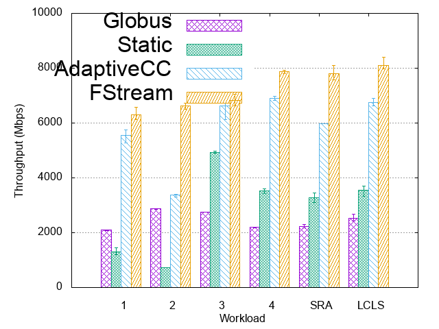
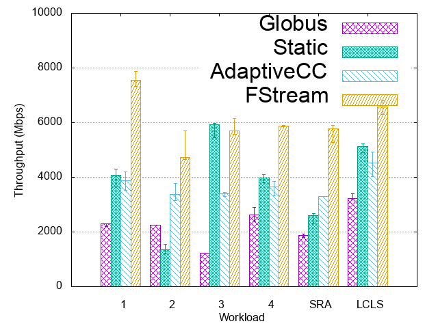
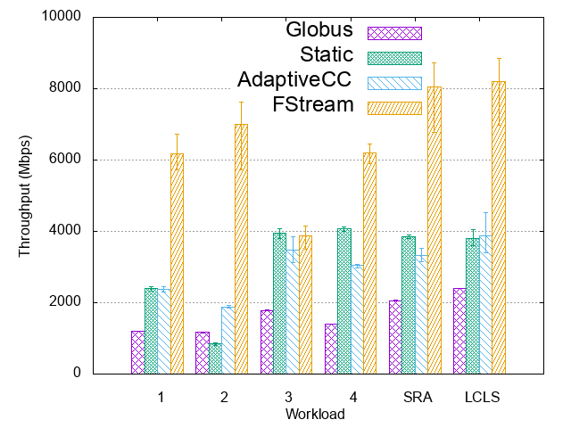

## FStream

#### Application level throughput optimization. 

FStream offers performance guarantees to time-sensitive streaming applications 
by continuously monitoring transfer performance and adjusting transfer settings (concurrency, parallelism, pipelining)
through online profiling to adapt dynamic system conditions and sustain high network performance. 
FStream also takes advantage of the long-running nature of streaming workflows and keeps track of past profiling 
results to greatly reduce the convergence time of future online profiling executions. We evaluated 
the performance of FStream by transferring several synthetic and real-world workloads using high-performance 
production networks and found that it offers up to an order of magnitude performance improvement over 
state-of-the-art transfer applications.

#### Project structure
```
.AdaptiveGridFTPClient/             # FStream Client
├── src                              # Source files 
|    ├── main                
|    |    ├── shell-scripts            # helper scritps
|    |    ├── java                     # java codes
|    |    ├── python                   # Experiments and optimizer
|    |    ├── resources                # configuration files
|    ├── test                         # tests
├── logs                             # transfer logs
└── README.md
.axis/                              #lib
.gridftp/                           #lib
...                                 #lib
```

#### Evaluation
In this project, we used the [GridFTP](https://en.wikipedia.org/wiki/GridFTP) and [JGlobus](https://github.com/jglobus/JGlobus/) to transfer the huge volume of data between three pairs of [XSEDE](https://www.xsede.org/) sites. Thus, we increased average throughput by 2.3x-9.1x comparatively to previous works and existing transfer methods.  

   


