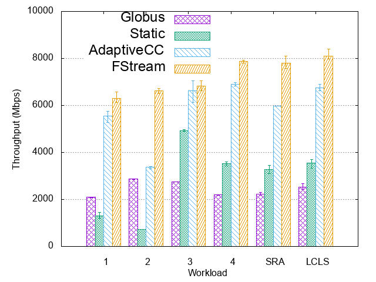

## FStream - Stream Data Transfer Optimization for Distributed Scientific Workflows

#### Real-time Application level throughput optimization. 

Robust and predictable network performance is critical for
distributed science workflows to move large volumes of streaming data
and help breakthrough discoveries be made timely. However, existing
data transfer applications are designed for batch workloads in a way that
their settings cannot be altered once they are set. This, in turn, severely
limits streaming applications from adapting to changing dataset and net-
work conditions to meet stringent transfer performance requirements.
In this paper, we propose FStream to offer performance guarantees to
time-sensitive streaming applications by continuously monitoring trans-
fer performance and adjusting transfer settings through online profiling
to adapt dynamic system conditions and sustain high network perfor-
mance. FStream also takes advantage of long-running nature of stream-
ing workflows and keeps track of past profiling results to greatly reduce
convergence time of future online profiling executions. We evaluated the
performance of FStream by transferring several synthetic and real-world
workloads using high-performance production networks and found that
it offers up to an order of magnitude performance improvement over
state-of-the-art transfer applications.

#### Project structure
```
.AdaptiveGridFTPClient/             # FStream Client
├── src                              # Source files 
|    ├── main                
|    |    ├── shell-scripts            # helper scritps
|    |    ├── java                     # java codes
|    |    ├── python                   # Experiments and optimizer
|    |    ├── resources                # configuration files
|    ├── test                         # tests
├── logs                             # transfer logs
└── README.md
.axis/                              #lib
.gridftp/                           #lib
...                                 #lib
```
### Reqiuriments
- Linux environment. 
- This project runs on XSEDE Grid computer networks. Also, it uses `myproxy-logon` certificate.
 ```myproxy-logon -s myproxy.xsede.org -l [username] -t 9999```

### Parameters
```
-s				: source path
-d				: destination path
-rtt				: round trip time 
-bandwidth [value]		: user defined bw value
-profiling			: activate Profiling transfer
-static				: activate Static transfer
-qos				: activate Quality of Service
-speedLimit [value]		: set QoS speed limit
-buffer-size
```

#### Evaluation
In this project, we used the [GridFTP](https://en.wikipedia.org/wiki/GridFTP) and [JGlobus](https://github.com/jglobus/JGlobus/) to transfer the huge volume of data between three pairs of [XSEDE](https://www.xsede.org/) sites. Thus, we increased average throughput by 2.3x-9.1x comparatively to previous works and existing transfer methods.  

<!---
| Stampede2 - Comet Transfer Results | OSG - Stampede2 Transfer Results | Bridges - Comet Transfer Results | 
| ----------- | ----------- | ----------- |
|  | |  |
--->

<p align="center">
  
</p>

Our proposed model adapts transfer settings according to ongoing throughput rates and changing file characteristics during transfers. Thus, it changes concurrency, pipelining and parallelism value according to the heuristic algorithm. Results showed that profiling transfers outperform other existing models. 

<p align="center">
  
</p>
